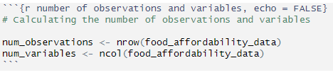

```{r setup, include = FALSE}
knitr::opts_chunk$set(echo = TRUE)
```

```{r libraries, include =  FALSE, message = FALSE, warning = FALSE}
# Loading libraries for the project
library(tidyverse)
library(countrycode)
library(knitr)
```

## Research Question

In recent years, the rising cost of living crisis has represented a particularly cumbersome period for economies worldwide as inflationary pressures on the price of food and energy have pushed households and businesses to the brink (Whiting, 2022; Shipman et al., 2023). Rising food prices in particular have consequentially affected a large number of people and their financial ability to afford groceries. This project will investigate this matter of food insecurity, and consider the following: how much of the population globally are unable to afford a healthy diet?

a large number of people have become increasingly exposed to food affordability issues. This project will investigate the matter of food insecurity, and consider the following: how much of the population across the globe are at risk of not affording a healthy diet?

## Dataset Introduction

Data for this project was sourced from [Our World in Data](https://ourworldindata.org/food-prices) in the Food Prices Data Explorer under the Food Prices topic, which in turn sourced its data from the Food and Agriculture Organization of the United Nations ('FAO') and the World Bank. Three different datasets were utilised for this project:

-   [Number of people that cannot afford a healthy diet](https://ourworldindata.org/explorers/food-prices?Diet=Healthy+diet&Cost+or+Affordability=Affordability&Affordability+metric=Number+that+cannot+afford&Cost+metric=%25+of+average+food+expenditure&country=NGA~BGD~IND~ETH~MEX~USA~BRA~GBR)

-   [Share of population that cannot afford a healthy diet](https://ourworldindata.org/explorers/food-prices?Diet=Healthy+diet&Cost+or+Affordability=Affordability&Affordability+metric=Share+that+cannot+afford&Cost+metric=%25+of+average+food+expenditure&country=NGA~BGD~IND~ETH~MEX~USA~BRA~GBR)

-   [Cost of a healthy diet as a share of average expenditure on food](https://ourworldindata.org/explorers/food-prices?Diet=Healthy+diet&Cost+or+Affordability=Cost+&Affordability+metric=Share+that+cannot+afford&Cost+metric=%25+of+average+food+expenditure&country=NGA~BGD~IND~ETH~MEX~USA~BRA~GBR)

We will be observing the most recent year (i.e. 2021) that data is readily available for all variables of interest in this project.

The first two variables of interest *Number of people that cannot afford a healthy diet* and *Share of population that cannot afford a healthy diet* detail the number and percentage share of a country's population that cannot afford a healthy diet, where: "

will be looking at both the number and percentage share of a country's population that cannot afford a healthy diet, where: "The cost of a healthy diet is the lowest-cost set of foods available that would meet requirements in dietary guidelines from governments and public health agencies. A diet is defined as unaffordable when its cost, plus basic non-food needs like housing and transportation, exceeds daily income" (Ritchie et al., 2023).

Regarding the third and last variable of interest, *Cost of a healthy diet as a share of average expenditure on food*, it showcases the cost of a healthy diet represented as a ratio against a person's average food expenditure in a particular country.

```{r variable names}
# LIsting the variable names
variable_names <- data.frame(
  Variable_Names = c(
    "Country",
    "Continent",
    "Number of people who cannot afford a healthy diet",
    "Share of the population who cannot afford a healthy diet",
    "Affordability of a healthy diet: ratio of cost to food expenditures"
  ))

kable(variable_names, caption = "Variable Names of Interest")
```

## Dataset Description

The R code chunk below demonstrates the data cleaning process for this project.

```{r dataset cleaning, message = FALSE}
# Reading individual CSV files into respective dataframes
number_healthy_diet <- read.csv("Data/number-healthy-diet-unaffordable.csv")

share_healthy_diet <- read.csv("Data/share-healthy-diet-unaffordable.csv")

cost_healthy_diet <- read.csv("Data/cost-healthy-diet-share-food-expenditure.csv")

# Filtering the data for most recent year available and selecting the relevant columns
number_healthy_diet_2021 <- number_healthy_diet %>% 
  filter(Year == 2021) %>% 
  select(Entity, 4)

share_healthy_diet_2021 <- share_healthy_diet %>% 
  filter(Year == 2021) %>% 
  select(Entity, 4)

cost_healthy_diet_2021 <- cost_healthy_diet %>% 
  filter(Year == 2021) %>% 
  select(Entity, 4)

# Merging dataframes based on Entity variable (i.e. Name of Country)
food_affordability_data <- number_healthy_diet_2021 %>%
  left_join(share_healthy_diet_2021, by = "Entity") %>% 
  left_join(cost_healthy_diet_2021, by = "Entity")

# Renaming Entity variable to 'Country' and cleaning header names to introduce spacing

food_affordability_data <- food_affordability_data %>% 
  rename(Country = Entity,
         `Number of people who cannot afford a healthy diet` = Number.of.people.who.cannot.afford.a.healthy.diet,
         `Share of the population who cannot afford a healthy diet` = Share.of.the.population.who.cannot.afford.a.healthy.diet,
         `Affordability of a healthy diet: ratio of cost to food expenditures` = Affordability.of.a.healthy.diet..ratio.of.cost.to.food.expenditures
  )

# Removing invalid entries under 'Country' variable
invalid_country_entries <-  c("East Asia & Pacific (WB)", 
                              "Europe & Central Asia (WB)",
                              "High-income countries",
                              "Latin America & Caribbean (WB)",
                              "Low-income countries",
                              "Lower-middle-income countries",
                              "Middle East & North Africa (WB)",
                              "North America (WB)",
                              "South Asia (WB)",
                              "Sub-Saharan Africa (WB)",
                              "Upper-middle-income countries",
                              "World")

food_affordability_data <- food_affordability_data %>% 
  filter(!Country %in% invalid_country_entries)

# Removing invalid N/A entries under all variable columns
food_affordability_data <- na.omit(food_affordability_data)

# Re-grouping countries by their Continents using the 'countrycode' package
food_affordability_data <- food_affordability_data %>% 
  mutate(
    Continent = countrycode(Country, origin = "country.name", destination = "continent")
  )

# Re-arranging the variables columns
food_affordability_data <- food_affordability_data %>% 
  select(Country, Continent, everything())
```

```{r number of observations and variables, echo = FALSE}
# Calculating the number of observations and variables

num_observations <- nrow(food_affordability_data)
num_variables <- ncol(food_affordability_data)
```

The dataset regarding the affordability of healthy diets contains `r num_observations` observations and `r num_variables` variables. Please note the code to derive the number of observations and variables is, as below:

```{r screenshot, echo = FALSE}
# Implementing the screenshot into the project

```

As observed below, the first two rows of the dataset can be displayed with `str()` to showcase the type of variables within the dataset.

```{r first two rows, echo = FALSE}
# Displaying the first two rows of the dataset
str(food_affordability_data[1:2,])
```

## Data Summary

```{r data summary - part a}
# Summary statistics for 'Number of people who cannot afford a healthy diet' and 'Affordability of a healthy diet: ratio of cost to food expenditures'
data_summary <- food_affordability_data %>% 
  group_by(Continent) %>% 
  summarise(
    Mean_Number = format(mean(`Number of people who cannot afford a healthy diet`, na.rm = TRUE), scientific = FALSE),
    Sum_Number = format(sum(`Number of people who cannot afford a healthy diet`, na.rm = TRUE), scientific = FALSE),
    Mean_Share = format(mean(`Share of the population who cannot afford a healthy diet`, na.rm = TRUE), scientific =  FALSE),
    Median_Share = format(median(`Share of the population who cannot afford a healthy diet`, na.rm = TRUE), scientific = FALSE)
  ) %>% 
  head(10)

kable(data_summary, caption = "Summary statistics of the 'Number of people who cannot afford a healthy diet' and 'Share of the population who cannot afford a healthy diet' variables")
```

From the summary statistics, the continents of Asia holds the highest number of people unable to afford a healthy diet (at 1.612 billion) which is then followed by Africa (at 857 million), although Africa's population had a higher mean and median percentage share of the population being impacted compared to Asia's percentage share. **Please note that certain continents may not be represented accurately due to unavailable data and smaller pools of countries, such as Oceania (i.e. Australia and Fiji) where Fiji has skewed the represented data for the entire region.**

Given that Asia has the largest population unable to afford a healthy diet, we can examine this by further breaking down the numbers by country:

```{r data summary - part b}
# Population breakdown for 'Number of people who cannot afford a healthy diet' based on countries in Asia
asia_data <- food_affordability_data %>% 
  filter(Continent == "Asia") %>% 
  select(Country, `Number of people who cannot afford a healthy diet`) %>% 
  arrange(desc(`Number of people who cannot afford a healthy diet`))

kable (asia_data, caption = "Number of People Unable to Afford a Healthy Diet in Asia")
```

The data reveals that India, China and Pakista are the three most affected countries, with a combined total of 1.218 billion people who are unable to afford a healthy diet. This accounts for nearly 76% of the reported affected population in Asia. In contrast, Cyprus, Maldives, and the United Arab Emirates report none being impacted. This could indicate that either negligible numbers are affected, or potential under-reporting or data unavailability for these countries.

## Visualisations

```{r data visualisation}
# Creating the scatter plot for Affordability of a Healthy Diet across Continents
ggplot(food_affordability_data, aes(x = Continent, y = `Affordability of a healthy diet: ratio of cost to food expenditures`)) +
  geom_point() +
  labs(
    title = "Affordability of a Healthy Diet across Continents",
    x = "Continent",
    y =  "Ratio of Cost to Food Expenditures"
  )
```

The following observations are made for the categorical scatter plot above:

-   *Countries within the continents of Africa, the Americas, and Asia display data points that surpass 100% of the Ratio of Cost to Food Expenditures, indicating that people in these regions would have to spend more than their average food expenditure budget would allow in order to afford a healthy diet.*

-   In Africa, the highest ratio is 318% for the nation of Burundi, and for Asia, the sole outlier point is Syria at 301%. These nations are characterised by a history of volatility and conflict, and both struggle considerably with poverty (BBC, 2023).

## Conclusion

The research question for this project originally sought to determine how much of the population globally cannot afford a healthy diet. The findings present that a total sum of 2.686 billion people worlwide lack the means to afford a healthy diet, primarily in Africa and Asia. In these regions, food budgets are unable to match the total cost required to secure adequate nutrition. With one-third of the world impacted by this problem, the FAO's Director of the Agrifood Economics and Policy Division has highlighted that this represents a structural issue in our agrifood systems, requiring significant investment to help achieve the United Nation's goal of Zero Hunger by 2030 (Emsden, 2024).

## References

Whiting, K. (2022, September 21). *The cost-of-living crisis is having a global impact. Here's what countries are doing to help.* World Economic Forum. <https://www.weforum.org/stories/2022/09/cost-of-living-crisis-global-impact/>

Shipman, A., Smondel, A., Adhinegara, B. Y., Diamond, J. W., Vega, L. G., Shahrour, M. H., Martin, P. & Simpson, W. (2023, January 7). *Global economy 2023: how countries around the world are tackling the cost of living crisis*. The Conversation. <https://theconversation.com/global-economy-2023-how-countries-around-the-world-are-tackling-the-cost-of-living-crisis-196740>

Ritchie, H., Rosado, P., & Roser, M. (2023). *Food Prices*. Our World in Data. <https://ourworldindata.org/food-prices>

BBC. (2023, July 31). *Burundi country profile*. <https://www.bbc.com/news/world-africa-13085064>

BBC. (2023, April 19). *Syria country profile*. <https://www.bbc.com/news/world-middle-east-14703856>

Emsden, C. (2024, August 01). *Healthy diets remain unaffordable for a third of the world's population*. Food and Agriculture Organization of the United Nations. <https://www.fao.org/newsroom/detail/healthy-diets-remain-unaffordable-for-a-third-of-the-world-s-population/en>
